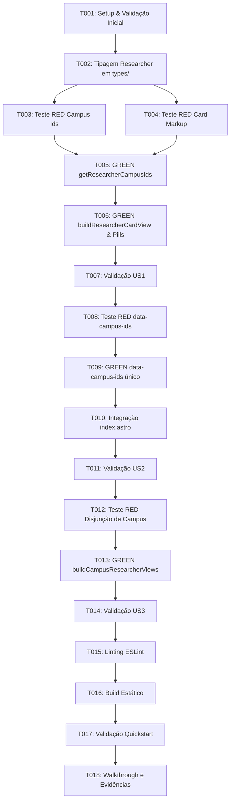

# Tasks: Exibição e Filtragem por Campus Principal em Pesquisadores

**Input**: Design documents from `specs/001-researcher-primary-campus/`  
**Prerequisites**: [plan.md](./plan.md), [spec.md](./spec.md), [research.md](./research.md), [data-model.md](./data-model.md), [contracts/researcher-card-contract.md](./contracts/researcher-card-contract.md)  
**Constitutional Principles**: Test-First (Principle I), Logic Outside Components (Principle II), Data Read-Only (Principle III)

---

## Format: `- [ ] [TaskID] [P?] [Story?] Description with exact file path`

- **[P]**: Tarefas paralelizáveis (arquivos distintos, sem dependência de tarefas anteriores incompletas)
- **[Story]**: Identificador da história de usuário ([US1], [US2], [US3])
- Todas as tarefas incluem caminhos de arquivos absolutos ou relativos à raiz do repositório

---

## Phase 1: Setup (Shared Infrastructure)

**Purpose**: Verificação do ambiente de execução e alinhamento dos contratos de teste.

- [X] T001 Confirmar suite de testes de filtro de campus ativa executando `npx vitest run tests/campus-filter.test.ts`

---

## Phase 2: Foundational (Blocking Prerequisites)

**Purpose**: Definição da tipagem formal que desbloqueia todas as histórias de usuário.

**⚠️ CRITICAL**: Nenhuma implementação de história de usuário pode iniciar sem a conclusão desta fase.

- [X] T002 Declarar formalmente o campo opcional `campus?: { id: string | number; name: string } | null` na interface `Researcher` em `src/types/researchers.ts`

**Checkpoint**: Tipagem do modelo de domínio atualizada e compatível com TypeScript strict mode.

---

## Phase 3: User Story 1 - Visualização Exclusiva do Campus Principal no Card (Priority: P1) 🎯 MVP

**Goal**: Garantir que cada card de pesquisador exiba unicamente a pílula de seu campus de lotação oficial, sem badges de overflow (`+N`), mesmo que participe de múltiplos grupos de pesquisa.

**Independent Test**: Um pesquisador com múltiplos grupos históricos (ex.: Maria Alice Veiga Ferreira De Souza) renderiza o card com apenas 1 pílula (`Vitória`) e zero ocorrências de `+1` ou `+2`.

### Tests for User Story 1 (TDD - RED Phase) ⚠️

> **NOTA: Executar estes testes e registrar a falha (RED) antes de implementar**

- [X] T003 [US1] Adicionar teste unitário em `tests/campus-filter.test.ts` verificando que `getResearcherCampusIds` retorna exclusivamente o campus principal para pesquisador com múltiplos grupos
- [X] T004 [US1] Adicionar teste de contrato em `tests/campus-filter.test.ts` verificando que `renderResearcherCardMarkup` gera no máximo uma pílula de campus e nenhum badge `+N`

### Implementation for User Story 1 (GREEN Phase)

- [X] T005 [US1] Atualizar `getResearcherCampusIds` em `src/lib/tenant-data.ts` para priorizar `researcher.campus` e retornar apenas o ID do campus principal com cache em memória
- [X] T006 [US1] Atualizar `buildResearcherCardView` e `renderCampusPills` em `src/lib/researcher-card-markup.ts` para renderizar apenas 1 pílula de campus e tratar ausência graciosamente sem badges residuais
- [X] T007 [US1] Executar `npx vitest run tests/campus-filter.test.ts` e confirmar passagem de todos os testes da US1 (GREEN)

**Checkpoint**: User Story 1 completa e testada de forma independente (MVP alcançado).

---

## Phase 4: User Story 2 - Filtragem e Busca Estrita pelo Campus Principal (Priority: P2)

**Goal**: Assegurar que a filtragem client-side e a pesquisa na página de pesquisadores operem estritamente sobre o campus de lotação, evitando que pesquisadores apareçam em campi onde apenas colaboraram.

**Independent Test**: Filtrar por "Cariacica" e verificar que pesquisadores de "Vitória" não aparecem na lista, mesmo tendo colaborado em grupos de Cariacica.

### Tests for User Story 2 (TDD - RED Phase) ⚠️

- [X] T008 [US2] Adicionar teste em `tests/campus-filter.test.ts` verificando o atributo `data-campus-ids` gerado no card e a regra de predição do filtro client-side

### Implementation for User Story 2 (GREEN Phase)

- [X] T009 [US2] Garantir que o atributo `data-campus-ids` em `renderResearcherCardMarkup` (`src/lib/researcher-card-markup.ts`) contenha unicamente o ID do campus principal
- [X] T010 [US2] Verificar o consumo de `campusIds` em `src/pages/researchers/index.astro` para assegurar que a reatividade do filtro por campus client-side permaneça íntegra
- [X] T011 [US2] Executar `npx vitest run tests/campus-filter.test.ts` e confirmar aprovação dos testes de filtragem estrita (GREEN)

**Checkpoint**: User Stories 1 e 2 plenamente funcionais e integradas.

---

## Phase 5: User Story 3 - Métricas e Visões de Campus sem Duplicidade Estatística (Priority: P3)

**Goal**: Garantir que a geração das visões de pesquisadores por campus (`campusResearcherViews`) crie conjuntos estritamente disjuntos, eliminando a inflação de dados e duplicações estatísticas nos dashboards analíticos.

**Independent Test**: Verificar que para qualquer par de campi distintos, a interseção de pesquisadores nas visões agregadas é vazia.

### Tests for User Story 3 (TDD - RED Phase) ⚠️

- [X] T012 [US3] Adicionar teste em `tests/campus-filter.test.ts` validando que `buildCampusResearcherViews` gera coleções disjuntas sem pesquisador repetido entre campi

### Implementation for User Story 3 (GREEN Phase)

- [X] T013 [US3] Atualizar `buildCampusResearcherViews` em `src/lib/researcher-collections.ts` para filtrar pesquisadores estritamente pelo seu campus principal
- [X] T014 [US3] Executar `npx vitest run tests/campus-filter.test.ts` e confirmar passagem dos testes de disjunção das visões de campus (GREEN)

**Checkpoint**: Todas as histórias de usuário (US1, US2, US3) concluídas e validadas por testes de unidade.

---

## Phase 6: Polish & Cross-Cutting Concerns

**Purpose**: Verificação de conformidade de lint, compilação de produção e documentação de evidências.

- [X] T015 Executar checagem de tipos e linting com `npm run lint:eslint`
- [X] T016 Executar compilação estática de produção com `npm run build`
- [X] T017 Executar cenários de validação visual descritos em `specs/001-researcher-primary-campus/quickstart.md`
- [X] T018 Criar registro de evidências e resultados dos testes no walkthrough da feature

---

## Dependencies & Execution Order

---

## Parallel Execution Opportunities

- As tarefas **T003** e **T004** (escrita de testes unitários para a US1) podem ser preparadas em paralelo.
- As tarefas de validação final **T015** (lint) e **T016** (build) podem ser executadas sequencialmente ou em terminais paralelos.

---

## Implementation Strategy & MVP Scope

- **Escopo do MVP (Fase 3 - US1)**: A entrega da User Story 1 já resolve a demanda imediata visual do usuário, assegurando que pesquisadores multigrupo exibam apenas seu campus oficial no card.
- **Incremento 2 (Fase 4 - US2)**: Estende a restrição para a filtragem client-side e busca na página.
- **Incremento 3 (Fase 5 - US3)**: Harmoniza as contagens estatísticas e gráficos por campus, garantindo consistência holística na plataforma.
