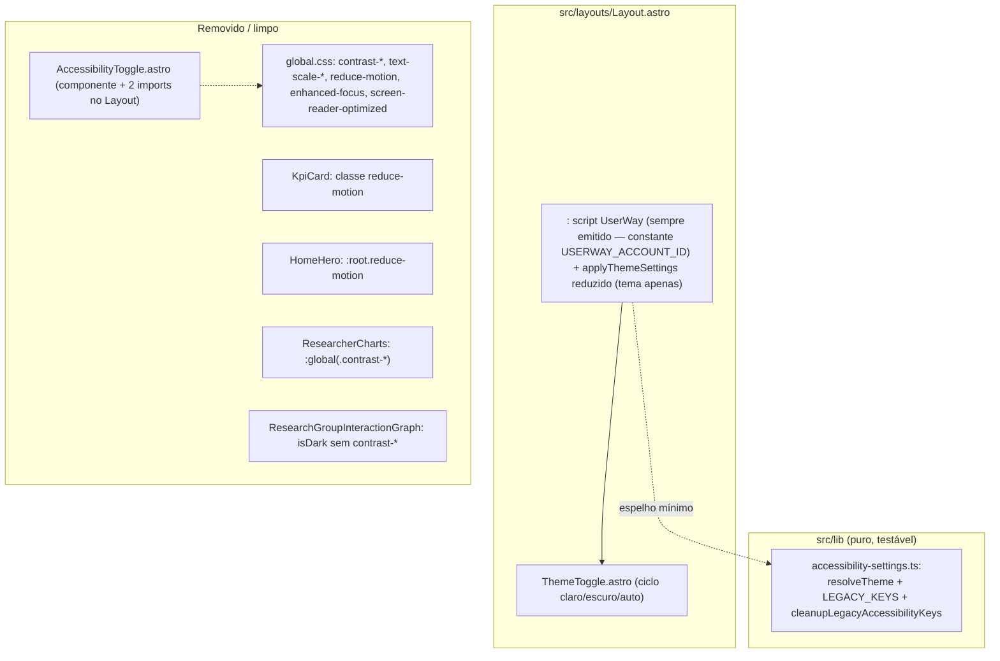

# Plano de Implementação Técnica: Substituição do Painel de Acessibilidade pelo Widget UserWay

> **Recurso**: Substituição do Painel de Acessibilidade pelo Widget UserWay
> **Fase SpecKit**: `/speckit.plan`
> **Especificação de Referência**: [specs/accessibility-userway-widget/spec.md](spec.md)
> **Constituição do Projeto**: [.agent/constitution.md](../../.agent/constitution.md)

---

## 0. Adaptação da Constituição ao Contexto do Dashboard

| Regra da constituição | Aplicação aqui |
|---|---|
| §2.1 TDD obrigatório | Testes Vitest antes da implementação, para toda lógica extraível (`accessibility-settings.ts`) |
| §2.2 Pytest / AAA / sem efeitos colaterais | Vitest com Arrange-Act-Assert; `localStorage` mockado/simulado, sem I/O real |
| §3.2 Lint | `npm run lint:eslint` |
| §3.3 Documentação primeiro | Este SpecKit + edição dos docs de requisito (RF-27/US-021) como tarefa final |

**Restrição arquitetural central** (mesma do `specs/graph-interaction-bugfixes/plan.md`): lógica
testável não vive em blocos `<script>` de componentes `.astro`. A lógica que **sobra** após a
remoção (resolução de tema e limpeza de chaves legadas) é extraída para `src/lib/accessibility-settings.ts`.
O script inline do `<head>` fica com um espelho mínimo de 3 linhas, coberto por teste de paridade (D-2).

---

## 1. Arquitetura da Solução



Até o fim da implementação, `Layout.astro` deixa de importar `AccessibilityToggle` e o HTML final
de qualquer página contém **um** script de widget no `<head>` e nenhum markup do painel antigo.

---

## 2. US-1 — Injeção do Widget UserWay

### 2.1 Constante no código (sem variável de ambiente)

O ID é público por natureza (aparece no HTML via `data-account`), então fica fixo no código —
exportado pelo módulo puro para ser reutilizável e testável:

```ts
import { USERWAY_ACCOUNT_ID } from "../lib/accessibility-settings";
const userwayAccount = USERWAY_ACCOUNT_ID; // "REPLACE_ME" até trocar pela conta real
```

Consequência aceita (decisão do produto, D-3): o widget é emitido em **todas** as builds (dev, CI,
preview, produção), sem gate por ambiente. Trocar de conta = editar a constante (um único lugar);
esvaziar a constante desliga o widget.

### 2.2 Snippet no `<head>` (primeiro script, após o `set:html` das fontes)

```tsx
{
  userwayAccount && (
    <script
      is:inline
      id="a11yWidgetSrc"
      src="https://cdn.userway.org/widget.js"
      data-account={userwayAccount}
      async
      crossorigin="anonymous"
    />
  )
}
```

- `is:inline` impede processamento/bundle pelo Astro; o atributo `data-account` é interpolado na
  renderização.
- **Posição do botão flutuante**: controlada pelo painel/UI da conta UserWay (dashboard → Widget
  Position / botão "Change Button Location" no widget), **sem** `data-position` no script. Motivo:
  segundo a documentação da UserWay, o atributo `data-position` "hard-coda" a posição e **bloqueia**
  a alteração pela UI (a UI avisa: "the position cannot be changed from this window; the user must
  first remove the position from the script"). Decisão de produto: posição ajustada na UI para
  **meio-direita** (lateral direita, centralizada verticalmente na tela do cliente).
- **Base path irrelevante**: a URL é absoluta de CDN; não há interação com `import.meta.env.BASE_URL`.
- **Instância única**: o script vive só no `<head>` do Layout (uma vez por página). O widget injeta
  seu próprio botão flutuante uma única vez — substitui os dois botões dos headers.
- **View Transitions**: o projeto hoje **não** usa `<ViewTransitions />` (verificado por grep); os
  listeners `astro:after-swap` existentes são defensivos. Se forem ativados no futuro, o botão
  injetado no `<body>` desapareceria no swap — registrar em `tasks.md` como pendência monitorada.

### 2.3 Notas de operação

- **ID fixo no código (sem `.env`)**: decisão do produto — a conta é pública por natureza e fica
  como constante `USERWAY_ACCOUNT_ID` (placeholder `"REPLACE_ME"`) em
  `src/lib/accessibility-settings.ts`. Não há variável de ambiente: todas as builds (dev, CI,
  preview, produção) emitem o widget. Trocar de conta = editar a constante.
- **Queda do CDN / bloqueio**: o restante do site segue integral (tema é local). O widget é
  progressivo; sem ele, os ajustes avançados ficam indisponíveis — aceitável e documentado no
  RF-27.
- **CSP futura**: se um dia houver Content-Security-Policy, permitir `script-src`,
  `style-src 'unsafe-inline'`, `img-src`, `frame-src`, `font-src` e `connect-src` para
  `cdn.userway.org` (e `*.userway.org`).
- **z-index/posição**: o botão flutuante do widget usa z-index alto. Conferir em QA visual se há
  sobreposição com o drawer mobile (`z-50`), o backdrop (`z-40`) e o dropdown de gráficos
  (`z-20`). Posição/idioma são configurados no dashboard UserWay (fora do código — D-3).
- **Privacidade**: widget não coleta PII/cookies — sem alterações de consentimento necessárias.

---

## 3. US-2 — Remoção do painel e das chaves legadas

### 3.1 Componente e imports

1. Deletar `src/components/AccessibilityToggle.astro`.
2. Remover import e os dois usos em `Layout.astro` (`:363` mobile, `:708` desktop).
3. Grep final por `AccessibilityToggle` — zero ocorrências.

### 3.2 CSS (`src/styles/global.css`)

Remover (mantendo `@media (prefers-reduced-motion: reduce)` em `@layer utilities`):

| Regra | Linha |
|---|---|
| `:root.text-scale-*` + `html { font-size: var(--base-font-size) }` | 98-117 |
| `:root.contrast-high` | 144-164 |
| `:root.contrast-maximum` + hack `.contrast-maximum .bg-border-main` | 166-189 |
| `:root.reduce-motion *` | 191-199 |
| `:root.enhanced-focus :focus-visible` | 201-206 |
| `:root.screen-reader-optimized [aria-hidden="true"]` | 208-212 |

A variável `--base-font-size: 100%` (linha 94-96) sai junto (sem `text-scale-*` ela é no-op).

### 3.3 Script do `<head>` — de `applyThemeSettings` para `applyThemeSettings` reduzido

Antes o script aplicava tema + contraste + escala + motion + foco + SR (linhas ~184-259). Depois:

```js
// Tema apenas. Espelha resolveTheme() de src/lib/accessibility-settings.ts (manter em sincronia).
function applyThemeSettings() {
    if (typeof localStorage === "undefined") return;
    const themePreference = localStorage.getItem("theme-preference") || "auto"; // D-2 / AC-3.2
    let theme = themePreference;
    if (theme === "auto") {
        theme = window.matchMedia("(prefers-color-scheme: dark)").matches ? "dark" : "light";
    }
    document.documentElement.classList.toggle("dark", theme === "dark");
}
applyThemeSettings();
document.addEventListener("astro:after-swap", applyThemeSettings);
```

- Default consolidado **`"auto"`** (AC-3.2) — corrige a divergência `light` × `auto` (§2.1 da spec).
- Removidos: bloco de contraste, migração `high-contrast` (linhas 220-227), bloco de `text-scale`,
  e os três toggles adicionais (240-251).
- **Sincronização com a lib (D-2)**: o espelho inline é idêntico por construção ao
  `resolveTheme`; teste de paridade garante os mesmos outputs para as mesmas entradas (ver §7).

### 3.4 Limpeza de chaves legadas (migração única)

Chamada no mesmo script do `<head>` (e testada via `cleanupLegacyAccessibilityKeys` na lib):

```ts
const LEGACY_ACCESSIBILITY_KEYS = [
    "contrast", "text-scale", "reduce-motion", "enhanced-focus",
    "screen-reader-optimized", "high-contrast", "theme",
];
export const cleanupLegacyAccessibilityKeys = (
    storage: Pick<Storage, "getItem" | "removeItem">,
): string[] => LEGACY_ACCESSIBILITY_KEYS.filter((key) => {
    try {
        if (storage.getItem(key) === null) return false;
        storage.removeItem(key);
        return true;
    } catch {
        return false;
    }
});
```

- Idempotente: segunda execução não encontra nada para remover (AC-2.2).
- Tolerante a `localStorage` indisponível (catch por chave).
- Retorna as chaves removidas para permitir log/depuração (sem log obrigatório por se tratar de
  limpeza de preferência, não estado crítico).

### 3.5 Consumidores das classes removidas (US-4)

| Arquivo | Mudança |
|---|---|
| `KpiCard.astro:83` | `prefersReduced` passa a considerar apenas `matchMedia("(prefers-reduced-motion: reduce)")` |
| `HomeHero.astro:261-263` | Remover os 3 seletores `:global(:root.reduce-motion)` |
| `ResearcherCharts.astro:373-374` | Remover overrides `.contrast-high`/`.contrast-maximum` do `.bg-glass-overlay` |
| `ResearchGroupInteractionGraph.astro:1390-1392` | `isDark` apenas `classList.contains("dark")` |
| `PersonInteractionGraph.astro` | Grep por `contrast-` para confirmar ausência de uso equivalente |

---

## 4. US-3 — Tema consolidado

### 4.1 `ThemeToggle.astro` — ciclo de 3 estados (D-1 decidido)

```ts
const ORDER = ["light", "dark", "auto"] as const;
const handleToggleClick = () => {
    const current = localStorage.getItem("theme-preference") || "auto";
    const next = ORDER[(ORDER.indexOf(current as never) + 1) % ORDER.length];
    localStorage.setItem("theme-preference", next);
    applyThemeSettings(); // se o espelho for movido para escopo global; senão, espelhar aqui
    updateLabel();
};
```

- Label dinâmico por estado, ex.: "Ativar tema escuro" (claro), "Ativar tema claro" (escuro),
  "Alternar para tema automático (sistema)" (auto).
- O gatilho passa a poder usar `aria-pressed`/rótulo para expor o estado atual (melhoria pequena e
  barata de semântica do botão).

### 4.2 Listener de `prefers-color-scheme` (AC-3.4)

```js
window.matchMedia("(prefers-color-scheme: dark)").addEventListener("change", applyThemeSettings);
```

Aplica-se somente quando o usuário está em `auto` (o próprio `applyThemeSettings` resolve).

---

## 5. US-5 — Módulo puro e testes (TDD)

### 5.1 `src/lib/accessibility-settings.ts`

| Export | Responsabilidade |
|---|---|
| `ThemePreference = "light" \| "dark" \| "auto"` | Tipo canônico da preferência |
| `resolveTheme(preference, systemPrefersDark)` | `"auto"` → segue o sistema; senão devolve a preferência (AC-3.2) |
| `LEGACY_ACCESSIBILITY_KEYS` | Lista canônica de chaves órfãs (fonte única; o `<head>` importa por valor via espelho) |
| `cleanupLegacyAccessibilityKeys(storage)` | Migração única e idempotente (AC-2.2) |

### 5.2 Testes novos (substituem `tests/accessibility.test.ts`)

| Grupo | Cobertura |
|---|---|
| `resolveTheme` | `light`/`dark` explícitos; `auto` + sistema claro/escuro; default é `"auto"` quando ausente |
| Paridade com o `<head>` | O espelho inline (representado como constante de teste com as mesmas entradas) produz os MESMOS outputs de `resolveTheme` — detecta divergência de defaults |
| `cleanupLegacyAccessibilityKeys` | Remove as 7 chaves quando presentes; idempotente (2ª chamada → `[]`); tolera `getItem`/`removeItem` lançando |
| Tema | `theme-preference` persiste `light`/`dark`/`auto` (herdado do teste antigo, agora sobre o tipo canônico) |

### 5.3 Testes removidos

Todos os casos que afirmavam persistência/classes do painel antigo (`contrast`, `text-scale`,
`reduce-motion`, `enhanced-focus`, `screen-reader-optimized` e `restore-defaults`) deixam de
existir — as chaves/classes sumiram por construção (AC-2.4).

---

## 6. Sequência de Implementação

1. **TDD** — escrever `tests/accessibility-settings.test.ts` (US-5) na fase RED.
2. **Lib** — criar `src/lib/accessibility-settings.ts`, incl. a constante `USERWAY_ACCOUNT_ID`
   (US-5, US-1).
3. **Layout** — injetar script do widget + reduzir `applyThemeSettings` + limpeza de chaves (US-1,
   US-2, US-3).
4. **ThemeToggle** — ciclo 3 estados + label dinâmico + listener do sistema (US-3).
5. **Limpeza** — deletar `AccessibilityToggle.astro`; remover imports, CSS e consumidores
   (US-2, US-4).
6. **Docs** — atualizar RF-27/US-021 (D-4).
7. **Validação** — vitest, lint, build + verificação no `dist/` (walkthrough).

Dependência: teste da lib precede a reescrita do `<head>`; a remoção do componente precede o grep
final. O restante é paralelizável por arquivo.

---

## 7. Riscos e Mitigações

| Risco | Mitigação |
|---|---|
| Widget com placeholder `REPLACE_ME` no deploy | ID fixo no código — TASK-013 confere `data-account` no `dist/` e sinaliza quando ainda é o placeholder |
| Divergência futura entre espelho do `<head>` e `resolveTheme` | Teste de paridade (§5.2) + comentário de sincronização no script inline (D-2) |
| Modo "Auto" perdido com a remoção do painel | D-1 decidido: ciclo de 3 estados `claro → escuro → auto` no `ThemeToggle` |
| FOUC de tema volta | Script permanece inline no `<head>` (primeiro paint) — AC-3.1 |
| View Transitions ativadas no futuro removem o botão do widget | Pendência monitorada registrada em `tasks.md`; re-injeção via `astro:after-swap` documentada |
| Overlap visual do widget com drawer/dropdowns | QA visual com `z-index` e configuração de posição no dashboard (nota §2.3) |
| Grep residual de chaves/classes legadas | AC-2.4 com verificação automatizada no walkthrough |
| 13 falhas pré-existentes na suíte (baseline conhecido) | Medir baseline antes; só aceitar zero regressões novas |

---

## 8. Critérios de Verificação (resumo)

| Critério | Como verificar |
|---|---|
| AC-1.1/1.3 | `dist/**/index.html` contém `<script ... src="https://cdn.userway.org/widget.js" data-account="…" async crossorigin>` no `<head>` |
| AC-1.4/1.5 | Grep global por `AccessibilityToggle`, `accessibility-menu-container`, `option-reduce-motion` → zero |
| AC-2.4 | Grep por `contrast-high\|contrast-maximum\|text-scale-\|reduce-motion\|enhanced-focus\|screen-reader-optimized` em `src/` e `tests/` → zero |
| AC-3.2 | Testes: default `"auto"` em `resolveTheme` e no espelho |
| AC-4.1/4.2 | Grep por `contrast-` nos componentes de grafo → zero |