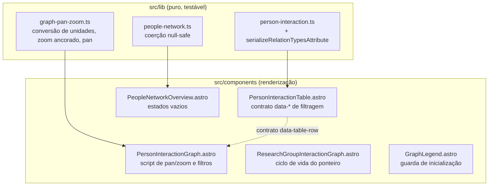

# Plano de Implementação Técnica: Correção de Defeitos dos Grafos de Interação

> **Recurso**: Correção de Defeitos dos Grafos de Interação  
> **Fase SpecKit**: `/speckit.plan`  
> **Especificação de Referência**: [specs/graph-interaction-bugfixes/spec.md](file:///home/rafael/horizon_dashboard_h/specs/graph-interaction-bugfixes/spec.md)  
> **Constituição do Projeto**: [.agent/constitution.md](file:///home/rafael/horizon_dashboard_h/.agent/constitution.md)

---

## 0. Adaptação da Constituição ao Contexto do Dashboard

A constituição foi redigida para o repositório ETL (Python/pytest/arquitetura hexagonal). Este
repositório é um front-end Astro + TypeScript. As regras foram traduzidas mantendo a intenção:

| Regra da constituição | Aplicação aqui |
|---|---|
| §2.1 TDD obrigatório | Testes Vitest escritos antes da implementação, para toda lógica extraível |
| §2.2 Pytest / AAA / sem efeitos colaterais | Vitest com padrão Arrange-Act-Assert, sem I/O real |
| §3.2 Type hints e docstrings | TypeScript estrito com tipos explícitos e JSDoc nas funções públicas |
| §3.2 Lint (`black`, `flake8`) | `npm run lint:eslint` |
| §1.2 Injeção de dependências | Funções puras recebendo estado como parâmetro, sem singletons ocultos |

**Restrição arquitetural central**: lógica testável não pode viver dentro de blocos `<script>` de
componentes `.astro`. A correção do BUG-002 exige, portanto, **extração** da matemática de
pan/zoom para um módulo em `src/lib/`, consumido pelo script do componente.

---

## 1. Arquitetura da Solução



---

## 2. BUG-001 — Contrato `data-*` entre grafo e tabela

O script de filtros já está escrito e correto; falta apenas o produtor do contrato. A solução é
**tornar o contrato explícito e testável**, em vez de espalhar strings mágicas pelo markup.

### 2.1 Camada de lógica

Nova função pura exportada por `src/lib/person-interaction.ts`, reexportada por
`src/lib/student-interaction.ts` (que já é a fachada usada pelos componentes):

```ts
/** Serializa os tipos de relação de uma linha para o atributo `data-relation-types`. */
export const serializeRelationTypesAttribute = (
    row: PersonInteractionTableRow,
): string => row.relations.map((relation) => relation.type).join(",");
```

O separador `,` e a ausência de espaços são exigidos pelo consumidor, que faz
`relationTypesStr.split(',').map(mapKey)`. A função `mapKey` do script já normaliza acentos,
sublinhados e sinônimos pt/en, então os valores canônicos em inglês (`initiative`,
`research_group`, `advisorship`, `article`) são aceitos sem tradução prévia.

### 2.2 Camada de markup (`PersonInteractionTable.astro`)

| Elemento | Atributos adicionados |
|---|---|
| `div` do rótulo de contagem | `data-table-count-label="true"`, `data-original-label={tableCountLabel}` |
| `tr` de cada linha | `data-table-row="true"`, `data-relation-types={serializeRelationTypesAttribute(row)}` |
| novo `div` após a tabela | `data-table-no-results="true"`, classe `hidden` |

O estado vazio novo é irmão da tabela e usa a classe `hidden` do Tailwind, porque o consumidor
manipula exatamente `classList.add/remove('hidden')`.

**Zebra striping**: as linhas usam `index % 2` para alternar o fundo. Com linhas ocultas via
`display: none`, a alternância visual fica irregular. Aceitável nesta iteração — corrigir exigiria
recolorir no cliente, e a legibilidade da tabela filtrada não depende disso.

---

## 3. BUG-002 — Unificação do sistema de coordenadas do pan/zoom

### 3.1 Modelo

A transformação aplicada é `translate(x, y) scale(s)` com `transform-origin: 0 0`, num `<g>` interno
ao SVG. Logo, `x`, `y` e todo o resultado da composição vivem em **unidades de usuário** (viewBox).
As entradas de ponteiro vivem em **pixels CSS**. A ponte entre os dois é:

$$u = \frac{W_{viewBox}}{W_{renderizado}} \quad\text{(unidades de usuário por pixel de tela)}$$

Um ponto de mundo $w$ é projetado em $x + w \cdot s$ (unidades de usuário). Para manter fixo o
ponto sob o cursor durante o zoom, com o cursor em $p$ pixels de tela (isto é, $p \cdot u$ unidades):

$$x' = p\,u - \left(p\,u - x\right) \cdot \frac{s'}{s}$$

Para o arrasto, um deslocamento de $\Delta$ pixels de tela corresponde a $\Delta \cdot u$ unidades:

$$x' = x_{origem} + \Delta_x \cdot u$$

### 3.2 Novo módulo `src/lib/graph-pan-zoom.ts`

Funções puras, sem dependência de DOM:

| Função | Responsabilidade |
|---|---|
| `getUnitsPerPixel(viewBoxWidth, renderedWidth)` | Razão $u$; devolve `1` para entradas inválidas ou não finitas |
| `clampScale(scale, minScale, maxScale)` | Limite de escala isolado e testável |
| `zoomAtPointer(transform, pointer, zoomFactor, unitsPerPixel, limits)` | Zoom ancorado no cursor |
| `panFromDrag(origin, deltaScreenX, deltaScreenY, unitsPerPixel)` | Translação a partir do arrasto |
| `toTransformStyle(transform)` | Serializa para a string CSS, mantendo o formato num só lugar |

O tipo `GraphPanZoomTransform` (`{ x, y, scale }`) é a única estrutura de estado.

### 3.3 Ajuste do script do componente

- `getUnitsPerPixel` é reavaliado a cada evento de roda e no `pointerdown` (cobre AC-2.4 sem
  observador adicional: a razão é lida no momento do uso).
- O arrasto passa a guardar a **origem da transformação** e a **posição inicial do ponteiro em
  pixels de cliente**, em vez do híbrido `clientX - translateX` atual, que só funcionaria se as
  unidades coincidissem.
- A razão capturada no `pointerdown` é reutilizada durante todo o arrasto, evitando salto caso o
  contêiner seja redimensionado no meio do gesto.
- `svg.viewBox.baseVal.width` é a fonte da largura do viewBox; havendo `0` (SVG sem viewBox), a
  razão cai para `1` e o comportamento degrada para o atual, sem lançar exceção.

---

## 4. BUG-003 — Coerção null-safe e estados vazios

### 4.1 `src/lib/people-network.ts`

Introdução de um utilitário local único para leitura de números opcionais:

```ts
const toOptionalNumber = (value: number | undefined): number | null =>
    typeof value === "number" && Number.isFinite(value) ? value : null;
```

Mudanças de contrato em `PeopleNetworkGraphSummary`:

| Campo | Antes | Depois |
|---|---|---|
| `isolatedNodeCount` | `number` (0 quando ausente) | `number \| null` |
| `largestComponentSize` | `number` (0 quando ausente) | `number \| null` |
| `largestComponentShare` | `number` (0 quando ausente) | `number \| null` |

`nodeCount`, `edgeCount` e `connectedComponentCount` permanecem `number`: são campos presentes em
todos os exports observados e representam a identidade mínima do grafo.

`largestComponentShare` só é calculado quando `largestComponentSize` é um número **e**
`nodeCount > 0`; caso contrário, `null`.

### 4.2 `PeopleNetworkOverview.astro`

- `formatInteger` e `formatPercent` já devolvem `"N/A"` para `null` — nenhuma mudança necessária
  nos formatadores.
- Adição de estado vazio para `topCollaborators` e `topConnectors`, com texto explicando que o
  ranking não está presente no export atual.

### 4.3 Compatibilidade

`tests/people-network.test.ts` exercita fixtures completas e afirma
`largestComponentShare === 0.6`. Esse caminho é preservado por construção (AC-3.4). Os novos testes
cobrem o caminho de ausência.

---

## 5. BUG-004 — Ciclo de vida da interação

| Item | Correção |
|---|---|
| `pointercancel` | Handler dedicado que zera `dragState` e libera a captura dentro de `try/catch` |
| `resizeCanvas` | Flag `hasUserAdjustedView`, marcada no `wheel` e no arrasto efetivo; o refit automático no `ResizeObserver` só ocorre enquanto ela for `false` |
| `GraphLegend` | Guarda `dataset.legendInitialized`, no mesmo padrão de `dataset.panZoomInitialized` e `dataset.filtersInitialized` |

A flag de enquadramento preserva a conveniência do auto-fit inicial (e em trocas de modo/filtro,
que chamam `applyFilters` diretamente) sem sequestrar o enquadramento manual.

---

## 6. Estratégia de Testes (TDD — constituição §2.1)

| Arquivo | Cobertura |
|---|---|
| `tests/graph-pan-zoom.test.ts` (novo) | Conversão de unidades, limites de escala, invariante de ancoragem do zoom, pan 1:1, serialização do estilo |
| `tests/person-interaction-table-contract.test.ts` (novo) | Formato do atributo `data-relation-types` e sua compatibilidade com o normalizador do consumidor |
| `tests/people-network.test.ts` (estendido) | Ausência de `largest_component_size`/`isolated_nodes` produzindo `null`; preservação dos valores com export completo |

**Invariante central do BUG-002**, expressa como teste: para qualquer razão de unidades, o ponto de
mundo sob o ponteiro antes do zoom é o mesmo ponto de mundo sob o ponteiro depois do zoom.

Os itens do BUG-004 vivem em manipuladores de eventos DOM inline e não são extraíveis sem
reescrever os componentes; serão verificados por inspeção e pelo build, conforme registrado em
`tasks.md`.

---

## 7. Riscos e Mitigações

| Risco | Mitigação |
|---|---|
| Mudança de tipo em `PeopleNetworkGraphSummary` quebrar consumidores | O único consumidor é `PeopleNetworkOverview.astro`, hoje órfão; `npm run build` valida |
| Regressão silenciosa no pan/zoom | Invariante de ancoragem coberta por teste, independente de DOM |
| Zebra striping irregular com linhas ocultas | Documentado como limitação aceita nesta iteração |
| Filtro da tabela divergir do filtro do grafo | Ambos consomem a mesma função `isEdgeMatch` do script, sobre o mesmo formato serializado |
