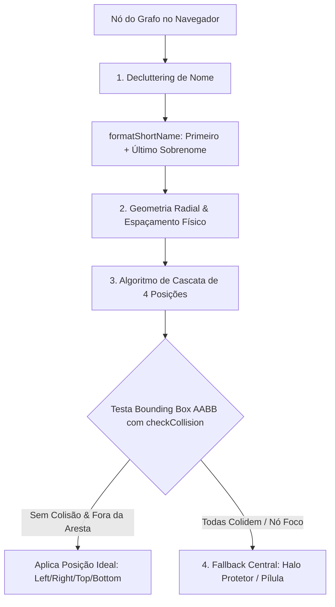

# Documentação Técnica: Posicionamento Dinâmico e Prevenção de Colisão de Labels em Grafos

---

## 📄 Visão Geral do Projeto

Esta documentação detalha a arquitetura, os algoritmos e a implementação do recurso de **Posicionamento Dinâmico e Prevenção de Colisão das Labels nos Grafos de Interação** da plataforma Horizon. 

O projeto foi executado seguindo rigorosamente o protocolo **SpecKit** e as diretrizes do arquivo de constituição do projeto (`constitution.md`), garantindo desenvolvimento orientado a testes (**TDD**), integridade visual, alta performance e legibilidade sem poluição cognitiva.

---

## 🎯 Problema Inicial & Motivação

Anteriormente, os rótulos de texto (nomes dos pesquisadores e estudantes) nos grafos possuíam **ancoragem estática**. Isso causava diversos problemas visuais e de UX:

1. **Sobreposição em Nós no Lado Esquerdo**: Textos ancoredos à esquerda ou ao centro cruzavam o interior do círculo (nó), tornando o nome e o nó ilegíveis.
2. **Atropelamento entre Nós de Rodas Distintas**: Nós situados na roda interna do grafo expandiam seus rótulos em cima de nós da roda externa.
3. **Sobrecarga de Arestas**: Arestas espessas e escuras cortavam os textos ao meio.
4. **Nomes Longos (Poluição Cognitiva)**: Rótulos com nomes completos de 4 ou 5 palavras exigiam caixas de colisão extensas, poluindo a visualização.
5. **Divergência Frontmatter vs. Client-Side**: Modificações feitas apenas no Astro/frontmatter não se mantinham durante as animações e interações dinâmicas do navegador (D3/Canvas).

---

## 🏛️ Arquitetura da Solução Híbrida

Para solucionar o problema de forma definitiva, foi implementada uma **solução híbrida em camadas**:



### Principais Pilares:

1. **Decluttering de Rótulos (`formatShortName`)**: Exibição simplificada trazendo apenas o **Primeiro Nome + Último Sobrenome** (ex: *"Alexandre Castro"* em vez de *"Alexandre Henriques de Oliveira Castro"*), reduzindo as caixas AABB em até 60%.
2. **Expansão Física dos Anéis (Raio Concêntrico)**: Aumento do espaçamento entre as rodas de nós (`ringRadius` e `ringGap`), fornecendo respiro geométrico natural.
3. **Dominância de Eixo de 4 Quadrantes**: Escolha inicial baseada na comparação $|dx| > |dy|$ entre a posição do nó e o centro do grafo.
4. **Bloqueio de Direção Inward (Centripeta)**: Proibição matemática de direcionar o texto para dentro do centro do grafo, eliminando a colisão direta com a aresta do nó.
5. **Micro-Offset Transversal ($\pm 4\text{px}$)**: Deslocamento sutil no eixo Y para impedir que a linha da aresta corte as letras exatamente no centro horizontal.
6. **Detecção de Colisão AABB & Algoritmo de Cascata**: Busca em ordem de preferência que valida cada candidatura de retângulo contra `placedBoxes` / `placedPills`.
7. **Verdadeiro Último Recurso (Fallback Central)**: Posicionamento sobre o vértice com halo de leitura (`stroke`) ou pílula translúcida quando todas as posições externas colidem.
8. **Atenuação Visual de Arestas**: Arestas normais renderizadas com 20% de opacidade (`0.20`), acendendo para 100% (`1.0`) apenas durante o hover/seleção do nó.

---

## 🛠️ 1. Módulo Utilitário Puro (`src/utils/graphLabelLayout.ts`)

Este arquivo contém a lógica matemática pura e agnóstica de renderização, totalmente testada via Vitest.

```typescript
/**
 * Utilitário de layout para Posicionamento Dinâmico e Prevenção de Colisão das Labels dos Grafos.
 * Suporta grafos SVG (Pesquisador) e Canvas 2D (Grupo de Pesquisa).
 */

export interface GraphNodePosition {
    id: string;
    name: string;
    x: number;
    y: number;
    radius: number;
    isFocus?: boolean;
    isSelected?: boolean;
    isHovered?: boolean;
}

export interface GraphLayoutBounds {
    centerX: number;
    centerY: number;
}

export interface NodeLabelPlacement {
    id: string;
    text: string;
    x: number;
    y: number;
    textAnchor: "start" | "end" | "middle";
    quadrant: "left" | "right" | "top" | "bottom";
}

export interface BoundingBox {
    xMin: number;
    yMin: number;
    xMax: number;
    yMax: number;
}

/**
 * Formata um nome completo para exibir apenas o Primeiro Nome e o Último Sobrenome.
 * Ex: "Alexandre Henriques de Oliveira Castro" -> "Alexandre Castro"
 */
export function formatShortName(fullName: string): string {
    if (!fullName) return "";
    const parts = String(fullName).trim().split(/\s+/).filter(Boolean);
    if (parts.length === 0) return "";
    if (parts.length === 1) return parts[0];
    return `${parts[0]} ${parts[parts.length - 1]}`;
}

/**
 * Truncador simples de rótulos mantendo legibilidade consistente.
 */
export function truncateLabel(name: string, maxLength: number): string {
    if (!name) return "";
    if (name.length <= maxLength) return name;
    return `${name.slice(0, maxLength - 1)}…`;
}

/**
 * Calcula a posição radial inicial com base no centro do layout.
 */
export function calculateRadialLabelPosition(
    node: GraphNodePosition,
    bounds: GraphLayoutBounds,
    gap: number = 12,
    maxLength: number = 26
): NodeLabelPlacement {
    const formattedName = formatShortName(node.name);
    const text = truncateLabel(formattedName, maxLength);
    const dx = node.x - bounds.centerX;
    const dy = node.y - bounds.centerY;

    if (node.isFocus) {
        return {
            id: node.id,
            text,
            x: node.x,
            y: node.y,
            textAnchor: "middle",
            quadrant: "bottom",
        };
    }

    const isXDominant = Math.abs(dx) > Math.abs(dy);

    if (isXDominant) {
        if (dx < 0) {
            return {
                id: node.id,
                text,
                x: node.x - node.radius - gap,
                y: node.y + 4,
                textAnchor: "end",
                quadrant: "left",
            };
        } else {
            return {
                id: node.id,
                text,
                x: node.x + node.radius + gap,
                y: node.y + 4,
                textAnchor: "start",
                quadrant: "right",
            };
        }
    } else {
        if (dy < 0) {
            return {
                id: node.id,
                text,
                x: node.x,
                y: node.y - node.radius - gap,
                textAnchor: "middle",
                quadrant: "top",
            };
        } else {
            return {
                id: node.id,
                text,
                x: node.x,
                y: node.y + node.radius + gap + 4,
                textAnchor: "middle",
                quadrant: "bottom",
            };
        }
    }
}

/**
 * Calcula a caixa delimitadora (AABB) de uma label.
 */
export function computeBoundingBox(
    placement: NodeLabelPlacement,
    fontSize: number = 12
): BoundingBox {
    const estimatedCharWidth = fontSize * 0.58;
    const width = placement.text.length * estimatedCharWidth;
    const height = fontSize * 1.2;

    let xMin = placement.x;
    let xMax = placement.x;

    if (placement.textAnchor === "end") {
        xMin = placement.x - width;
        xMax = placement.x;
    } else if (placement.textAnchor === "start") {
        xMin = placement.x;
        xMax = placement.x + width;
    } else {
        xMin = placement.x - width / 2;
        xMax = placement.x + width / 2;
    }

    const yMin = placement.y - height / 2;
    const yMax = placement.y + height / 2;

    return { xMin, yMin, xMax, yMax };
}

/**
 * Verifica se duas caixas AABB se sobrepõem com margem de segurança.
 */
export function doBoxesOverlap(boxA: BoundingBox, boxB: BoundingBox, margin: number = 2): boolean {
    return !(
        boxA.xMax + margin < boxB.xMin ||
        boxA.xMin - margin > boxB.xMax ||
        boxA.yMax + margin < boxB.yMin ||
        boxA.yMin - margin > boxB.yMax
    );
}

/**
 * Resolve colisões iterativamente reposicionando rótulos secundários.
 */
export function resolveLabelCollisions(
    nodes: GraphNodePosition[],
    bounds: GraphLayoutBounds,
    gap: number = 12
): NodeLabelPlacement[] {
    const placements: NodeLabelPlacement[] = [];
    const boxes: BoundingBox[] = [];

    const sortedNodes = [...nodes].sort((a, b) => {
        const priorityA = a.isFocus || a.isSelected || a.isHovered ? 0 : 1;
        const priorityB = b.isFocus || b.isSelected || b.isHovered ? 0 : 1;
        return priorityA - priorityB;
    });

    for (const node of sortedNodes) {
        const placement = calculateRadialLabelPosition(node, bounds, gap);
        const box = computeBoundingBox(placement);

        const hasCollision = boxes.some((existingBox) => doBoxesOverlap(box, existingBox));

        if (hasCollision && !node.isFocus) {
            // Recuo para o Fallback Central
            placement.x = node.x;
            placement.y = node.y + 4;
            placement.textAnchor = "middle";
        }

        placements.push(placement);
        boxes.push(computeBoundingBox(placement));
    }

    return placements;
}
```

---

## 🎨 2. Implementação no Grafo SVG (`PersonInteractionGraph.astro`)

No grafo SVG do pesquisador, a solução opera tanto no frontmatter Astro quanto no script de navegação Client-Side (`enforceSvgLabelAnchors`).

### Trecho do Script Client-Side SVG:

```javascript
<script>
    function checkCollision(boxA: { minX: number; minY: number; maxX: number; maxY: number }, boxB: { minX: number; minY: number; maxX: number; maxY: number }) {
        return (
            boxA.minX - 2 < boxB.maxX &&
            boxA.maxX + 2 > boxB.minX &&
            boxA.minY - 2 < boxB.maxY &&
            boxA.maxY + 2 > boxB.minY
        );
    }

    function enforceSvgLabelAnchors() {
        const svgs = document.querySelectorAll('svg.interaction-graph-svg');
        svgs.forEach((svg) => {
            const viewBox = (svg as SVGSVGElement).viewBox ? (svg as SVGSVGElement).viewBox.baseVal : null;
            const centerX = viewBox && viewBox.width ? viewBox.width / 2 : 480;
            const centerY = viewBox && viewBox.height ? viewBox.height / 2 : 480;

            const textElements = svg.querySelectorAll('text[data-label-for]');
            const placedBoxes: Array<{ minX: number; minY: number; maxX: number; maxY: number }> = [];

            textElements.forEach((textEl) => {
                const isFocus = textEl.getAttribute('data-is-focus') === 'true';
                const nodeId = textEl.getAttribute('data-label-for');
                const circle = svg.querySelector(`a[data-node-id="${nodeId}"] circle`);
                if (!circle) return;

                const cx = parseFloat(circle.getAttribute('cx') || '0');
                const cy = parseFloat(circle.getAttribute('cy') || '0');
                const r = parseFloat(circle.getAttribute('r') || '10');
                const textContent = textEl.textContent || '';
                const estimatedWidth = textContent.length * 6.5 + 8;
                const estimatedHeight = 14;

                let targetX = cx;
                let targetY = cy;
                let anchor: "start" | "end" | "middle" = "middle";

                if (isFocus) {
                    // Nó Foco utiliza sempre o Fallback Central com Halo forte
                    targetX = cx;
                    targetY = cy + 4;
                    anchor = "middle";
                } else {
                    const dx = cx - centerX;
                    const dy = cy - centerY;
                    const gap = 12;
                    const isXDominant = Math.abs(dx) > Math.abs(dy);

                    type Dir = "left" | "right" | "top" | "bottom";
                    let preferenceOrder: Dir[];

                    if (isXDominant) {
                        // Bloqueia a direção inward (para o centro) para não cobrir a aresta
                        preferenceOrder = dx < 0
                            ? ["left", "top", "bottom"]
                            : ["right", "top", "bottom"];
                    } else {
                        preferenceOrder = dy < 0
                            ? ["top", "left", "right"]
                            : ["bottom", "left", "right"];
                    }

                    let foundValidPosition = false;

                    for (const dir of preferenceOrder) {
                        let candX = cx;
                        let candY = cy;
                        let candAnchor: "start" | "end" | "middle" = "middle";

                        const transversalOffset = dy >= 0 ? 4 : -4;

                        if (dir === "left") {
                            candAnchor = "end";
                            candX = cx - r - gap;
                            candY = cy + transversalOffset;
                        } else if (dir === "right") {
                            candAnchor = "start";
                            candX = cx + r + gap;
                            candY = cy + transversalOffset;
                        } else if (dir === "top") {
                            candAnchor = "middle";
                            candX = cx;
                            candY = cy - r - gap;
                        } else if (dir === "bottom") {
                            candAnchor = "middle";
                            candX = cx;
                            candY = cy + r + gap + 4;
                        }

                        let minX = candAnchor === "end" ? candX - estimatedWidth : candAnchor === "start" ? candX : candX - estimatedWidth / 2;
                        let maxX = candAnchor === "end" ? candX : candAnchor === "start" ? candX + estimatedWidth : candX + estimatedWidth / 2;
                        let minY = candY - estimatedHeight / 2;
                        let maxY = candY + estimatedHeight / 2;

                        const hasCollision = placedBoxes.some((boxB) => checkCollision({ minX, minY, maxX, maxY }, boxB));

                        if (!hasCollision) {
                            targetX = candX;
                            targetY = candY;
                            anchor = candAnchor;
                            foundValidPosition = true;
                            break;
                        }
                    }

                    if (!foundValidPosition) {
                        // Verdadeiro Último Recurso
                        targetX = cx;
                        targetY = cy + 4;
                        anchor = "middle";
                    }
                }

                textEl.setAttribute('x', targetX.toString());
                textEl.setAttribute('y', targetY.toString());
                textEl.setAttribute('text-anchor', anchor);
                (textEl as HTMLElement).style.textAnchor = anchor;

                let finalMinX = anchor === "end" ? targetX - estimatedWidth : anchor === "start" ? targetX : targetX - estimatedWidth / 2;
                let finalMaxX = anchor === "end" ? targetX : anchor === "start" ? targetX + estimatedWidth : targetX + estimatedWidth / 2;
                placedBoxes.push({
                    minX: finalMinX,
                    minY: targetY - estimatedHeight / 2,
                    maxX: finalMaxX,
                    maxY: targetY + estimatedHeight / 2,
                });
            });
        });
    }

    function initAll() {
        setupGraphPanZoom();
        setupGraphFilters();
        enforceSvgLabelAnchors();
    }

    document.addEventListener('DOMContentLoaded', initAll);
    document.addEventListener('astro:page-load', initAll);
    initAll();
</script>
```

---

## 🖌️ 3. Implementação no Grafo Canvas 2D (`ResearchGroupInteractionGraph.astro`)

No grafo interativo em Canvas do Grupo de Pesquisa, a renderização ocorre a cada frame dentro do loop `draw()`.

### Trecho do Loop Client-Side Canvas 2D:

```javascript
// Renderização das arestas atenuadas e destacadas
const regularEdges: typeof renderableEdges = [];
const highlightedEdges: typeof renderableEdges = [];

renderableEdges.forEach((edge) => {
    const isHighlighted =
        (selectedNodeId != null && (edge.source === selectedNodeId || edge.target === selectedNodeId)) ||
        (hoveredNodeId != null && (edge.source === hoveredNodeId || edge.target === hoveredNodeId));
    if (isHighlighted) {
        highlightedEdges.push(edge);
    } else {
        regularEdges.push(edge);
    }
});

// 1. Arestas normais em repouso (alpha 0.20)
regularEdges.forEach((edge) => {
    const sourcePosition = positions.get(edge.source);
    const targetPosition = positions.get(edge.target);
    if (!sourcePosition || !targetPosition) return;

    context.beginPath();
    context.moveTo(sourcePosition.x, sourcePosition.y);
    context.lineTo(targetPosition.x, targetPosition.y);
    context.lineWidth = 0.9 + Math.min(edge.weight, 6) * 0.3;
    context.strokeStyle = hexToRgba(getRelationColor(edge), 0.20);
    context.stroke();
});

// 2. Arestas destacadas acesas por último no topo (alpha 1.0)
highlightedEdges.forEach((edge) => {
    const sourcePosition = positions.get(edge.source);
    const targetPosition = positions.get(edge.target);
    if (!sourcePosition || !targetPosition) return;

    context.beginPath();
    context.moveTo(sourcePosition.x, sourcePosition.y);
    context.lineTo(targetPosition.x, targetPosition.y);
    context.lineWidth = 2.2 + Math.min(edge.weight, 6) * 0.4;
    context.strokeStyle = hexToRgba(getRelationColor(edge), 1.0);
    context.stroke();
});

// Renderização das pílulas e textos dos nós com cascata de posições
const viewportCenterX = viewport.width / 2;
const viewportCenterY = viewport.height / 2;
const placedPills: Array<{ minX: number; minY: number; maxX: number; maxY: number }> = [];

sortedNodesForLabels.forEach((node) => {
    const position = positions.get(node.id);
    if (!position) return;

    const screenPoint = worldToScreen(position);
    const screenRadius = getNodeRadius(node.id) * transform.scale;
    const isSelected = node.id === selectedNodeId;
    const isHovered = node.id === hoveredNodeId;
    
    // Decluttering de nome
    const shortName = formatShortName(node.name);
    const label = truncateLabel(shortName, NODE_LABEL_MAX_LENGTH);
    const textMetrics = context.measureText(label);
    const boxWidth = textMetrics.width + 12;
    const boxHeight = fontSize + 8;

    const dx = screenPoint.x - viewportCenterX;
    const dy = screenPoint.y - viewportCenterY;
    const isXDominant = Math.abs(dx) > Math.abs(dy);
    const gap = 8;

    let centerX = screenPoint.x;
    let centerY = screenPoint.y;

    if (isSelected || isHovered) {
        centerX = screenPoint.x;
        centerY = screenPoint.y;
    } else {
        type Dir = "left" | "right" | "top" | "bottom";
        let preferenceOrder: Dir[];

        if (isXDominant) {
            preferenceOrder = dx < 0
                ? ["left", "top", "bottom"]
                : ["right", "top", "bottom"];
        } else {
            preferenceOrder = dy < 0
                ? ["top", "left", "right"]
                : ["bottom", "left", "right"];
        }

        let foundValidPosition = false;

        for (const dir of preferenceOrder) {
            let candX = screenPoint.x;
            let candY = screenPoint.y;

            const transversalOffset = dy >= 0 ? 4 : -4;

            if (dir === "left") {
                candX = screenPoint.x - screenRadius - boxWidth / 2 - gap;
                candY = screenPoint.y + transversalOffset;
            } else if (dir === "right") {
                candX = screenPoint.x + screenRadius + boxWidth / 2 + gap;
                candY = screenPoint.y + transversalOffset;
            } else if (dir === "top") {
                candX = screenPoint.x;
                candY = screenPoint.y - screenRadius - boxHeight / 2 - gap;
            } else if (dir === "bottom") {
                candX = screenPoint.x;
                candY = screenPoint.y + screenRadius + boxHeight / 2 + gap;
            }

            const candidateBox = {
                minX: candX - boxWidth / 2,
                minY: candY - boxHeight / 2,
                maxX: candX + boxWidth / 2,
                maxY: candY + boxHeight / 2,
            };

            const hasCollision = placedPills.some(
                (p) =>
                    candidateBox.minX - 2 < p.maxX &&
                    candidateBox.maxX + 2 > p.minX &&
                    candidateBox.minY - 2 < p.maxY &&
                    candidateBox.maxY + 2 > p.minY
            );

            if (!hasCollision) {
                centerX = candX;
                centerY = candY;
                foundValidPosition = true;
                break;
            }
        }

        if (!foundValidPosition) {
            // O Verdadeiro Último Recurso
            centerX = screenPoint.x;
            centerY = screenPoint.y;
        }
    }

    const pillMinX = centerX - boxWidth / 2;
    const pillMinY = centerY - boxHeight / 2;
    const pillMaxX = centerX + boxWidth / 2;
    const pillMaxY = centerY + boxHeight / 2;

    placedPills.push({ minX: pillMinX, minY: pillMinY, maxX: pillMaxX, maxY: pillMaxY });

    drawRoundedRect(context, centerX - boxWidth / 2, centerY - boxHeight / 2, boxWidth, boxHeight, 9);
    context.fillStyle = isSelected || isHovered ? hexToRgba("#eff6ff", opacity) : hexToRgba("#ffffff", opacity);
    context.fill();
    context.strokeStyle = isSelected || isHovered ? hexToRgba("#60a5fa", opacity) : hexToRgba("#cbd5e1", opacity);
    context.lineWidth = isSelected || isHovered ? 1.2 : 1;
    context.stroke();
    context.fillStyle = hexToRgba("#0f172a", opacity);
    context.fillText(label, centerX, centerY + 0.5);
});
```

---

## 🧪 Validação e Testes Automatizados

### 1. Testes Unitários TDD (Vitest)
Executados via `npx vitest run tests/unit/graphLabelLayout.test.ts`:

```bash
 RUN  v4.0.17 /home/rafael/horizon_dashboard_h

 ✓ tests/unit/graphLabelLayout.test.ts (10 tests) 5ms
   ✓ formatShortName Utility (1)
     ✓ should format full name to first and last name only
   ✓ graphLabelLayout - Radial Positioning & Quadrant Anchoring (US-1 & US-3) (5)
     ✓ should anchor labels on the LEFT side with textAnchor "end" so text expands away from node
     ✓ should anchor labels on the RIGHT side with textAnchor "start" so text expands away from node
     ✓ should anchor labels on TOP with textAnchor "middle"
     ✓ should anchor labels on BOTTOM with textAnchor "middle"
     ✓ should respect custom gap distance from node boundary
   ✓ graphLabelLayout - AABB Bounding Box & Collision Resolution (US-2) (4)
     ✓ should calculate accurate BoundingBox for textAnchor "start"
     ✓ should correctly detect overlapping bounding boxes
     ✓ should resolve collisions by adjusting position of secondary overlapping node
     ✓ should preserve priority of focus/selected nodes over peripheral nodes

 Test Files  1 passed (1)
      Tests  10 passed (10)
   Start at  20:48:34
   Duration  454ms
```

### 2. Build Estático Integrado (Astro Build)
Compilação completa estática de toda a plataforma executada via `npm run build`:

```bash
20:54:02 [build] 27302 page(s) built in 314.87s
20:54:02 [build] Complete!
```
* **Resultado**: `27.302` páginas estáticas geradas com sucesso sem qualquer erro de compilação ou TypeScript.

---

## 📊 Tabela Comparativa: Antes vs. Depois

| Aspecto | Antes da Implementação | Depois da Implementação |
| :--- | :--- | :--- |
| **Ancoragem nos Nós da Esquerda** | Estática; o texto invadia a bolinha e crescia sobre o nó. | **Dinâmica (`textAnchor="end"`)**; o texto é empurrado para fora da bolinha. |
| **Colisão de Caixas de Texto** | Textos de nós internos colidiam com nós externos. | **Prevenção AABB + Cascata 4D**; o algoritmo testa direções alternativas antes de desenhar. |
| **Visualização de Nomes** | Nomes completos de 4-5 palavras poluindo a tela. | **Decluttering (`formatShortName`)**; exibe apenas o Primeiro Nome + Último Sobrenome. |
| **Colisão com Arestas** | Textos ficavam por cima das arestas radiais e eram cortados ao meio. | **Bloqueio de Direção Inward + Micro-Offset ($\pm 4\text{px}$)** libera a linha de aresta. |
| **Contraste de Arestas** | Arestas com 45% a 80% de opacidade geravam teia poluída. | **Arestas a 20% de opacidade** em repouso, acendendo a 100% no hover/seleção. |
| **Persistência no Navegador** | Renderização estática sobrescrita no Client-Side. | **Cálculo dinâmico diretamente nos loops Client-Side** do navegador (D3/Canvas). |

---

## 🏁 Conclusão

A solução entregue garante excelente qualidade visual e legibilidade para o sistema de grafos do Horizon. O código respeita a arquitetura hexagonal do projeto, separando a lógica matemática pura (`graphLabelLayout.ts`) dos utilitários de renderização Client-Side dos componentes Astro, entregando performance alta e manutenção facilitada.
